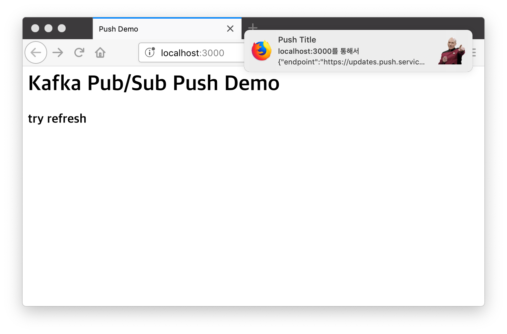

# web-push-node-kafka

Push service by node with kafka

- [rurumimic/kafka-manager](https://github.com/rurumimic/kafka-manager)
- [web-push-libs/web-push](https://github.com/web-push-libs/web-push)
- [vkarpov15/web-push-demo](https://github.com/vkarpov15/web-push-demo)
  - [vkarpov15/web-push-demo blog](https://thecodebarbarian.com/sending-web-push-notifications-from-node-js.html)

## npm install

```bash
npm init
npm install koa koa-static koa-bodyparser koa-router web-push kafka-node
```

**kafka-node**

`package.json`

```bash
"kafka-node": {
  "version": "^3.0.1",
  "no-optional": "true"
},
```

## Generate vapid keys

```bash
./node_modules/.bin/web-push generate-vapid-keys

Public Key:
BIxeru5kL-OXk3YtHVylXI-gemgilsoesL80YEKb_P9v5Y77Buh8afeZgP8-PbQErv8X5TQ9qwl97mJK8_wtlSs

Private Key:
qkxmH3zHvdhTbAyk__ty05PDePJtC6Nzko3zpzHKE5k
```

## docker-compose.yml

For test, use my [kafka-manager/docker-compose.yml](https://github.com/rurumimic/kafka-manager/blob/master/docker-compose.yml)

Edit `KAFKA_ADVERTISED_HOST_NAME: <HOSTIP>` by your host ip.

and

```bash
docker-compose up -d
```

**make topic**

Go to [localhost:9000](http://localhost:9000).

Kafka Manager - Menu - Cluster - Add Cluster
- Cluster Name: anything
- Cluster Zookeeper Hosts: `zoo:2181`
- Check:
  - Enable JMX Polling (Set JMX_PORT env variable before starting kafka server)
  - Poll consumer information (Not recommended for large # of consumers)

Save

and go to your Cluster.

Kafka Manager - Menu - Topic - Create
- Topic: topic-test (the node server code's topic name is 'topic-test')
- Partition: 1
- Replication Factor: 1

Create

## Run

```bash
node server.js
```

and go to '[localhost:3000](http://localhost:3000)'

use Chrome or Firefox.

## Result


